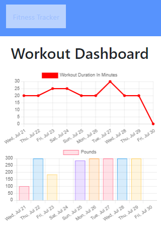

# FitnessTrackHa

## Summary

A fitness tracker which uses Express Server and MongoDB.
The data which it keeps track of is the workout:
-name
-type
-weight
-sets
-reps
-duration

This application categories cardio and weight exercise.

## Table of Contents
- [Screeny](#Screeny)
- [Links](#Links)
- [Author](#Author)

## Screeny

## Links
Deployed Link:
https://git.heroku.com/fitnesstrackha.git

Github link:
https://github.com/RichoHa/fitnessTrackHa

## Author
Richard Ha
https://github.com/RichoHa

